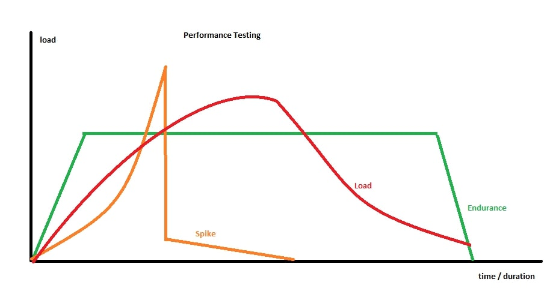

> ## Demo Agenda
>Installation
>
>Basic examples:
>
>* GET_example.js
>	--http-debug
>* script.js
>* http_post.js
>* selectors.js
>
>Kinds of performance tests, how they translate (Endurance testing, stages, pic)
>
>Thresholds.js  vs checks
>
>Test life cycle
>
>BO examples
>
>Cloud & [token](https://app.loadimpact.com/account/token)
>
> Pipeline
> 
> Postman to k6 ([Protocol Adapter](https://code.siemens.com/horizon/facility-manager-ba/pa-haystack) example)


# k6 performance tests independent repository

## [Setup](https://docs.k6.io/docs/installation)
Linux:
```bash
sudo apt-key adv --keyserver hkp://keyserver.ubuntu.com:80 --recv-keys 379CE192D401AB61
echo "deb https://dl.bintray.com/loadimpact/deb stable main" | sudo tee -a /etc/apt/sources.list
sudo apt-get update
sudo apt-get install k6
```

[Windows msi](https://dl.bintray.com/loadimpact/windows/k6-latest-amd64.msi)

## Running k6

```bash
k6 run script.js
```

On Windows you may need to:
```bash
k6.exe run script.js
```

With http debugging:
```bash
k6 run --http-debug script.js
```

## Testing
For endurance testing, use fixed amount of users for a duration:
```javascript
export let options = {
  // endurance test for 30 seconds with 50 virtual users. Adds users immediately
  vus: 50,
  duration: "30s",
  // you can also specify the exact number of iterations the test will run
  // iterations: 500,
}
```
For load, spike and scalability use stages:
```javascript
export let options = {
  // for 15 seconds ramps up 10 users, adds users gradually
  // adds a total of 40 users in the next 15 seconds, and up to 50 in the next 30 seconds..
  // lowers down the users to 10 and 5 in the next 15 second iterations
  stages: [
    { duration: "15s", target: 10 },
    { duration: "15s", target: 40 },
    { duration: "30s", target: 50 },
    { duration: "15s", target: 10 },
    { duration: "15s", target: 5 },
  ]
}
```



## Checks and thresholds
Thresholds are used to 'assert' timing metrics.

Checks are like asserts but they do not halt execution; they verify that things work as expected but do not fail the whole test run based on the results.


```javascript
export let options = {
  thresholds: {
    // average, max, 90%tile, 95%tile response time under X milliseconds. Failed assertions will fail the test
    http_req_duration: [
      "avg<6000",
      "max<10000",
       "p(90)<7000", 
       "p(95)<8000"
    ]
  }
}
```

Checking a response:
```javascript
  // thse checks will not fail the test, will only store the result of the assertion
  check(res, {
    'status code is 200': r => r.status === 200,
  }) || fail('either did not get 200');

```
Other useful assertions that can be made on responses:
```javascript
  res.body // string containing the HTTP response body
  res.headers // bbject containing header-name/header-value pairs
  res.status // integer containing HTTP response code received from server
  res.timings // object containing HTTP timing information for the request on ms
  res.timings.blocked // the metric http_req_blocked
  res.timings.looking_up // the metric http_req_looking_up
  res.timings.connecting // the metric http_req_connecting
  res.timings.sending // the metric http_req_sending
  res.timings.waiting // the metric http_req_waiting
  res.timings.receiving // the metric http_req_receiving
  res.timings.duration // the metric http_req_duration
```

For more information on k6 visit https://docs.k6.io/docs.

## [Test life cycle](https://docs.k6.io/docs/test-life-cycle)
The function signature of the default function and teardown function takes an argument, which we here refer to as data. This data will be whatever is returned in the setup function, it is a mechanism for passing data between stages.
```javascript
// 1. init code -> runs once
export function setup() {
    // 2. setup code -> runs once
}
export default function(data) {
    // 3. vu code -> runs many times 
}
export function teardown(data) {
    // 4. teardown code -> runs once
}
```

## Record the results to cloud
> After a user is created at www.loadimpact.com and an API token is acquired for the account, an [environment variable](https://docs.k6.io/docs/environment-variables) can be specified for `K6_CLOUD_TOKEN` to record the tests to the cloud service. The free account allows for 5 tests per hour with up to 25 users. Past the limits you cannot record to the cloud with `-o cloud` modifier.

Record the local run to the cloud.
```
k6 run -o cloud script.js
```
Use the cloud service to run the test and record to the cloud.
  > Only the first 50 cloud tests are free!
```
k6 cloud script.js
```

## Run in pipeline 

```yml
loadtest-northbound:
  stage: perf-test
  image:
    name: loadimpact/k6
    entrypoint: [""]
  only:
      - schedules
  script:
    - k6 run ./k6-performance/getNBroutes.js
  cache: {}
  tags:
    - DOCKER
    - NOPROXY
    - CLOUD
  retry:
    max: 1
```

## Postman to k6

Postman collections can be partially converted to k6-loadimpact performance tests using [postman-to-k6](https://github.com/loadimpact/postman-to-k6).

```bash
npm install -g postman-to-k6
```

Example of converting a collection:
```bash
## postman-to-k6 <collection> -e <postman-environment-file> -o <output-file>
postman-to-k6 HaystackAdapterTest.postman_collection.json -e HorizonAPI.postman_environment.json -o pa-perf.js

## running the collection
k6 run PostmanScripts/pa-perf.js
```

### Manual work after conversion to k6

* It is critical that the global environment object exists.

* Alongside global object, it is critical that the environment variables get exported correctly; they are used in tests.

  ```javascript
  // example from Protocol Adapter https://code.siemens.com/horizon/facility-manager-ba/pa-haystack
  postman[Symbol.for("initial")]({
    options,
    global: {
      gatewayId: "" // the gateway gets created at test: Create (register) a Gateway
    },
    environment: {
      ADAPTER_ID: "haystack-adapter",
      DEVICE_API_HOST: "device-component-cubs.horizon-int.siemens.io/",
      DEVICE_API_PORT: "80",
      PA_API_HOST_PROD: "https://pa-fm-ba.horizon.siemens.io",
      PA_API_HOST: "https://pa-boic.horizonint.cloud",
      PA_API_HOST_INT: "https://pa-boic.horizonint.cloud",
      PA_API_HOST_DEV: "https://pa-boic.horizondev.cloud"
    }
  });
  ```

* Order of operations is important for setup and teardown. Tests need to be grouped to replicate a BDD-Jasmine like behavior to ensure these dependencies.

* `pm.test` statements inside other `pm.test` statements are not supported. `pm.sendRequest` will be supported in future versions of `postman-to-k6`. Follow up in [k6 blog](https://blog.loadimpact.com/new-postman-to-k6-converter-tool-with-support-for-pre-request-and-test-scripts) or [postman-to-k6 github](https://github.com/loadimpact/postman-to-k6/issues/13)

